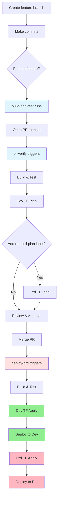
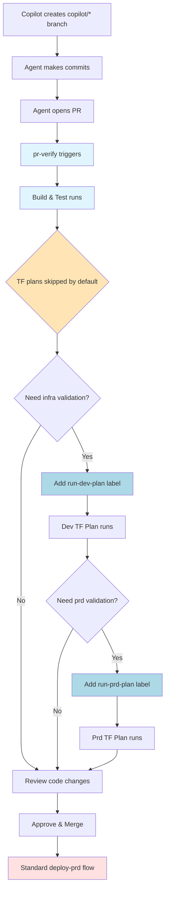

# Development Workflows

Target: Senior engineers working on portal-web. Covers branch strategy, CI/CD triggers, and typical development flows.

## Branch Strategy & Triggers

### Feature Development (feature/*, bugfix/*, hotfix/*)
- **build-and-test.yml**: Runs on push to feature branches
  - Build and test via `dotnet-web-ci` composite action
  - No deployments
  - Purpose: Fast feedback loop for WIP changes

### Pull Requests → main
- **pr-verify.yml**: Full validation pipeline
  - Build and test
  - Terraform plan for dev (skips for dependabot and copilot/* branches unless labeled)
  - Terraform plan for prd (requires `run-prd-plan` label)
  - Concurrency groups prevent parallel dev/prd operations
  - Copilot branches: Terraform plans skipped by default; add `run-dev-plan` label to enable

### Main Branch (on merge)
- **deploy-prd.yml**: Full promotion pipeline
  - Build → Deploy Dev → Deploy Prd
  - Uses `terraform-plan-and-apply` composite action
  - Concurrent execution prevented via workflow-level concurrency group
  - Also triggers: Weekly schedule (Thursday 3am UTC), manual dispatch

### Scheduled & On-Demand
- **codequality.yml**: Weekly Monday 3am UTC + on PR/push to main
  - SonarCloud analysis (skips dependabot)
- **deploy-dev.yml**: Manual dispatch only
  - Fast path to refresh dev environment without merging to main
- **copilot-setup-steps.yml**: Validates agent setup on workflow changes

## Standard Developer Flow

### Local Development
```bash
# Standard validation sequence (from dotnet-commands.instructions.md)
dotnet clean src/XtremeIdiots.Portal.Web/XtremeIdiots.Portal.Web.csproj
dotnet build src/XtremeIdiots.Portal.Web/XtremeIdiots.Portal.Web.csproj
dotnet test src --filter "FullyQualifiedName!~IntegrationTests"
```

### Feature Branch → PR → Merge Flow

**Note**: This diagram shows the standard flow for `feature/*`, `bugfix/*`, and `hotfix/*` branches. For `copilot/*` branches, Terraform plans are skipped by default unless explicitly enabled with labels (see "Copilot Agent Flow" section below).



### Infrastructure Changes
- Dev Terraform plan runs automatically on PRs, except for copilot/* and dependabot PRs (copilot PRs can opt in via the `run-dev-plan` label)
- Prd Terraform plan requires explicit `run-prd-plan` label
- Plans use OIDC auth via environment variables from GitHub environments
- Concurrency groups (`${{ github.repository }}-dev`, `-prd`) serialize operations per environment

## Copilot Agent Flow

### Copilot Branch Behavior
- Copilot creates branches with `copilot/*` prefix
- **pr-verify.yml** special handling:
  - Terraform plans skipped by default (avoids noisy/unnecessary infra checks)
  - Add `run-dev-plan` label to PR to enable dev plan
  - Add both `run-dev-plan` and `run-prd-plan` to run both plans

### Agent Setup
- **copilot-setup-steps.yml** defines pre-requisites
  - Checkout code, setup .NET 9.0.x
  - Runs automatically when workflow file changes
  - Manual dispatch available for testing

### Typical Copilot Session Flow



## Composite Actions (frasermolyneux/actions)

All workflows delegate to reusable composite actions from the `actions` repo:

- **dotnet-web-ci**: Build, test, publish web application
- **terraform-plan**: Init, plan, upload plan artifact
- **terraform-plan-and-apply**: Init, plan, apply in single job
- **deploy-app-service**: Deploy web app to Azure App Service

These composites use `@main` tag, so updates apply immediately across all repos.

## Quick Reference

| Scenario           | Workflow       | Trigger                  | Terraform     | Deploy  |
| ------------------ | -------------- | ------------------------ | ------------- | ------- |
| Feature commit     | build-and-test | Push to feature/*        | ❌             | ❌       |
| PR validation      | pr-verify      | PR to main               | Dev plan      | ❌       |
| Merge to main      | deploy-prd     | Push to main             | Dev+Prd apply | Dev+Prd |
| Manual dev refresh | deploy-dev     | Manual dispatch          | Dev apply     | Dev     |
| Weekly maintenance | deploy-prd     | Thursday 3am UTC         | Dev+Prd apply | Dev+Prd |
| Code quality       | codequality    | Monday 3am UTC + PR/push | ❌             | ❌       |

## Environment Secrets

OIDC authentication uses GitHub environment variables (not secrets):
- `AZURE_CLIENT_ID`: Service principal app ID
- `AZURE_TENANT_ID`: Azure AD tenant
- `AZURE_SUBSCRIPTION_ID`: Target subscription

Defined in **Development** and **Production** environments within GitHub repository settings.
